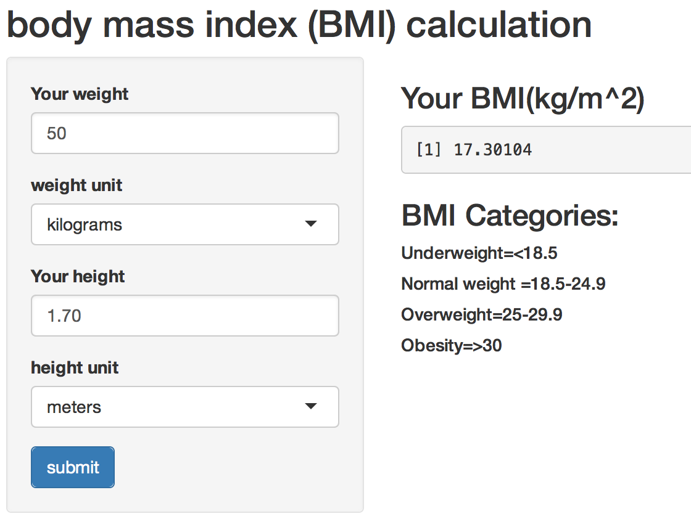

project_report:
Introduction to the BMI calculator shiny app
========================================================
author: C Jiang
date: Sun Jun 21 12:35:54 2015

 <small><small> - Inputs of this BMI calculator are <font color='blue'>weight</font>,<font color='blue'>weight unit</font>,<font color='blue'>height</font>, and <font color='blue'>height unit</font>.  Default inputs are <font color='blue'>50 kg</font> and <font color='blue'>1.7 meter</font>. </small></small> 
<small><small> - Output of this BMI calculator is <font color='blue'>your BMI $(kg/m^2)$</font>. </small></small> 
<small><small>  - <font color='blue'>textinput box</font>, <font color='blue'>selectinput box</font>, and one <font color='blue'>submit button</font> are used in this shiny app. </small> </small>
<small><small>  - <font color='blue'>The BMI categories</font> are also listed out for your reference.</small> </small>
Overview of the BMI calculator shiny app
========================================================



ui.R
========================================================


```r
library(shiny)
shinyUI(fluidPage(
    titlePanel("body mass index (BMI) calculation"),   
    sidebarLayout(sidebarPanel(
            textInput("weight", "weight",  "50"),            
            selectInput ("var1", "unit",
                         c("pounds","kilograms"),"kilograms"),
            textInput("height", "height",  "1.70"),                 
            selectInput ("var2","unit",
                         c("inches","feet","meters"),"meters"),
            submitButton("submit")),       
        mainPanel() # mainPanel will be listed in the next page 
)))
```

<!--html_preserve--><div class="container-fluid">
<h2>body mass index (BMI) calculation</h2>
<div class="row">
<div class="col-sm-4">
<form class="well">
<div class="form-group shiny-input-container">
<label for="weight">weight</label>
<input id="weight" type="text" class="form-control" value="50"/>
</div>
<div class="form-group shiny-input-container">
<label class="control-label" for="var1">unit</label>
<div>
<select id="var1"><option value="pounds">pounds</option>
<option value="kilograms" selected>kilograms</option></select>
<script type="application/json" data-for="var1" data-nonempty="">{}</script>
</div>
</div>
<div class="form-group shiny-input-container">
<label for="height">height</label>
<input id="height" type="text" class="form-control" value="1.70"/>
</div>
<div class="form-group shiny-input-container">
<label class="control-label" for="var2">unit</label>
<div>
<select id="var2"><option value="inches">inches</option>
<option value="feet">feet</option>
<option value="meters" selected>meters</option></select>
<script type="application/json" data-for="var2" data-nonempty="">{}</script>
</div>
</div>
<div>
<button type="submit" class="btn btn-primary">submit</button>
</div>
</form>
</div>
<div class="col-sm-8"></div>
</div>
</div><!--/html_preserve-->

server.R and the mainPanel
========================================================


<small>-In this **server.R**, a helper function **BMI_cal.R** is called to calculate the output of **your BMI** </small>

```r
source("BMI_cal.R")
shinyServer(function(input,output) {
    output$BMI<-renderPrint(
           BMI_cal(input$weight,input$var1,
                   input$height,input$var2))})
```


```r
  mainPanel(h4('Your BMI(kg/m^2)'),
            verbatimTextOutput("BMI"),
            h4('BMI Categories:'),
            h6('Underweight=<18.5'),
            h6('Normal weight =18.5-24.9'),
            h6('Overweight=25-29.9'),
            h6('Obesity=>30'))
```

<!--html_preserve--><div class="col-sm-8">
<h4>Your BMI(kg/m^2)</h4>
<pre id="BMI" class="shiny-text-output"></pre>
<h4>BMI Categories:</h4>
<h6>Underweight=&lt;18.5</h6>
<h6>Normal weight =18.5-24.9</h6>
<h6>Overweight=25-29.9</h6>
<h6>Obesity=&gt;30</h6>
</div><!--/html_preserve-->
```

helper.R
================
-A helper function is applied to calculate BMI and the formula for calculating BMI is :$$BMI=weight(kg)/(height(meter))^2$$

```r
BMI_cal<-function(weight,var1,height,var2) {
    weight<-as.numeric(weight)
    height<-as.numeric(height)
    # convert weight unit to kilograms
    if (var1=="pounds") weight<-weight*0.453592
    #convert height unit to meters
    if (var2=="inches") height<-height*0.0254
    else if (var2=="feet") height<-height*0.3048
    #apply the formula showed above
    weight/height^2    
}
```
